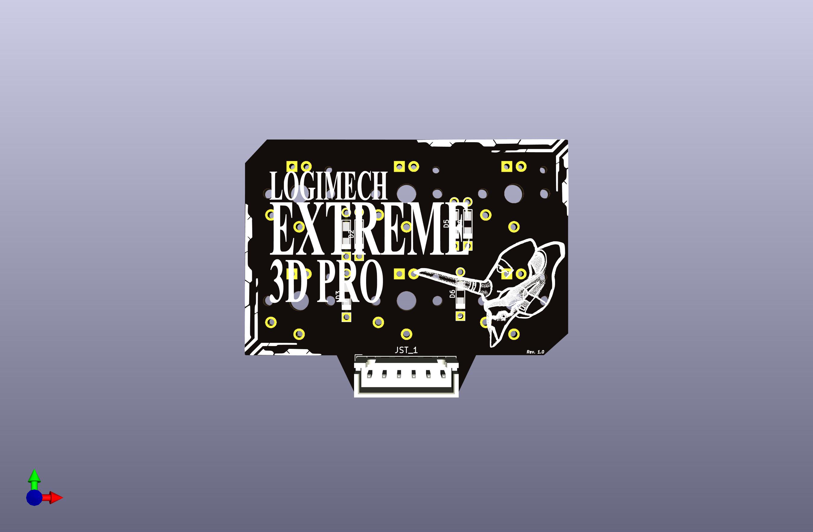
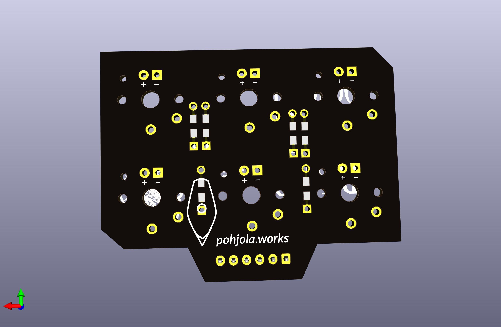

# Logimech
Replacement PCB for Logitech 3D Extreme joystick. Allows use of mechanical switches and MX keycaps for the side buttons of the joystick

## How to get
Gerber folder has plotted gerbers for the Rev 1 of Logimech. 
They were used to order from PCBWay, and should work atleast there.

## Notes:

Rev 1: User has reported some buttons physical location changed, this can be  fixed by remapping.
